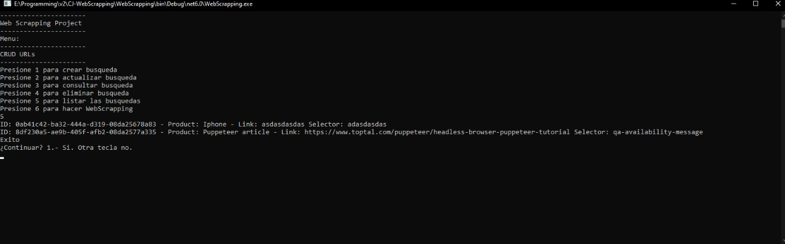
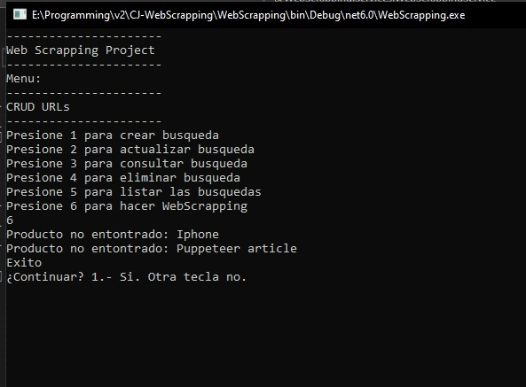

## CJ-WebScrapping

CJ-WebScrapping

Una aplicaion utilizada para listar, crear, actualizar y elimar elementos para realizar un busqueda en sitios webs especificados. (Web Scrapping con Puppeteer)

Las tecnologias utilizadas para la creacion de este proyecto son C#, Entity Framework Core y SQL Server.

## Estado del proyecto

Este proyecto actualmente se encuentra completado.

## Proyecto Screen Shot(s)

## Instacion y puesta de la aplicacion

#### Example:

Clone este repositorio. Necesita tener instalado DOT NET 6.

Para ejecutar el proyecto:

`dotnet run`

## Creadores

:star: Jose Almando Dominique 2021-1093

:star: Cristopher Zaiz 2021-0949
